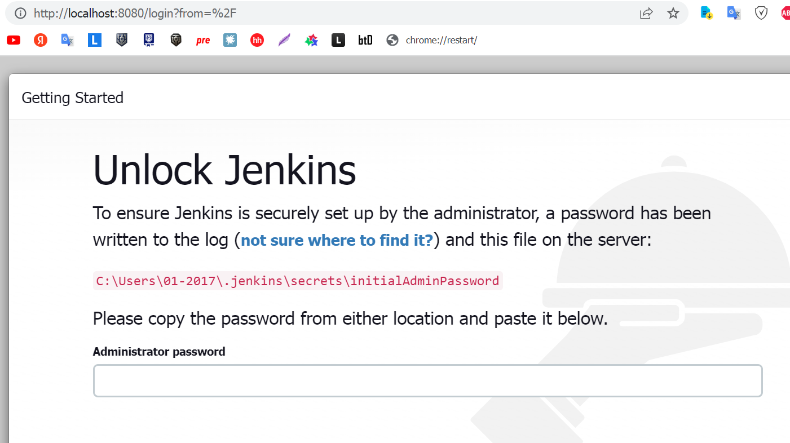
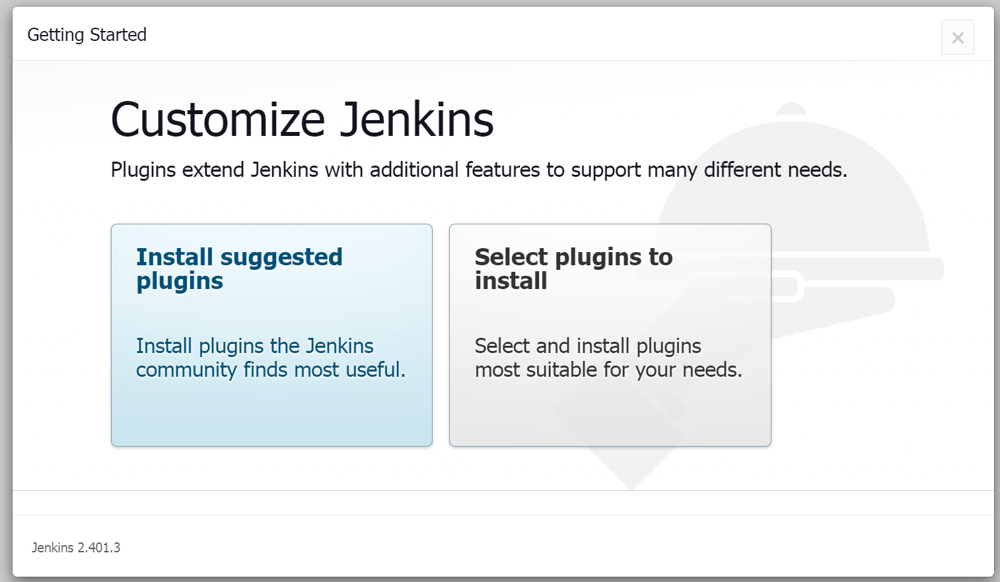
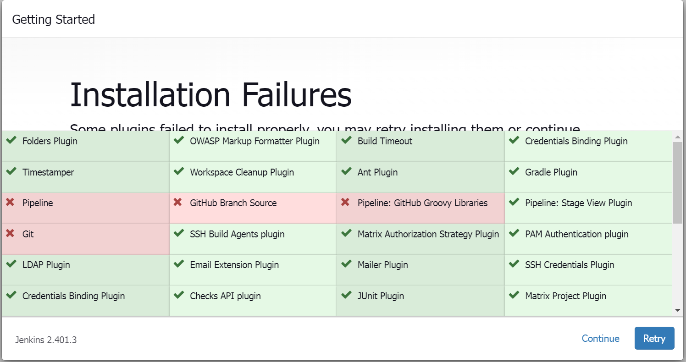
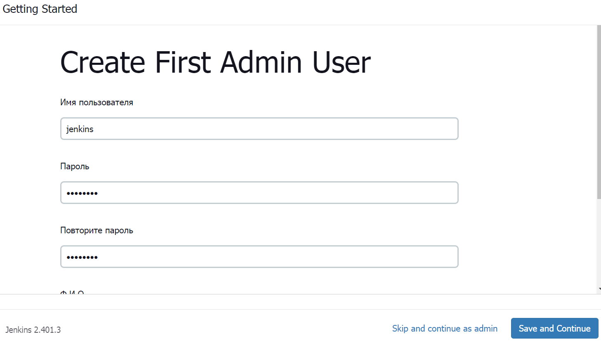

<a href="/README.md">вернуться к оглавлению</a>

<b>Настройка Jenkins</b>   
После первого запуска программы (из прошлой части) мы получили временный пароль  
`223dac81333d4cd3830d80b402d78126`  
для входа в систему 

Открываем браузер и идем по ссылке: 
`http://localhost:8080/ `

Скрин

  

Водим в поле "Administrator password" полученный ранее пароль 
Устанавливаем плагины по умолчанию

Скрин

  

Не все плагины устанавливаются вообще или устанавливаются с первого раза, 
пробуйте нажимать кнопку Retry или пробуйте более старые версии программы 

Скрин

  

Далее нам предлагают зарегистрировать администратора  

Скрин

  

и подтвердить URL
<pre>
Instance Configuration
Jenkins URL: http://localhost:8080/
</pre>