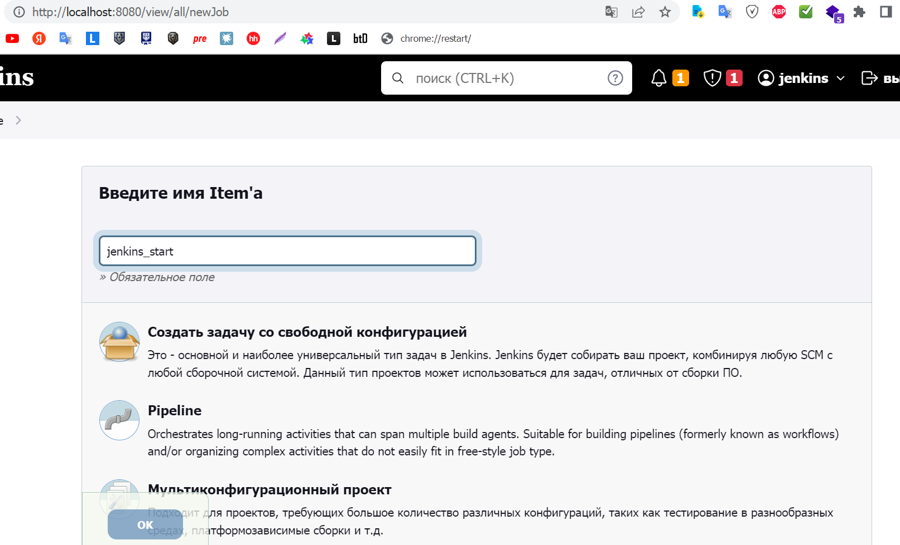
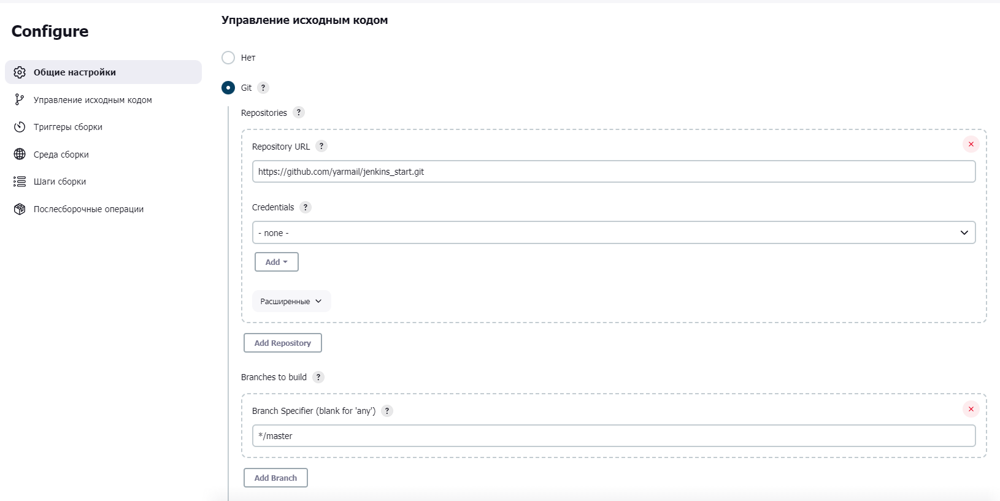
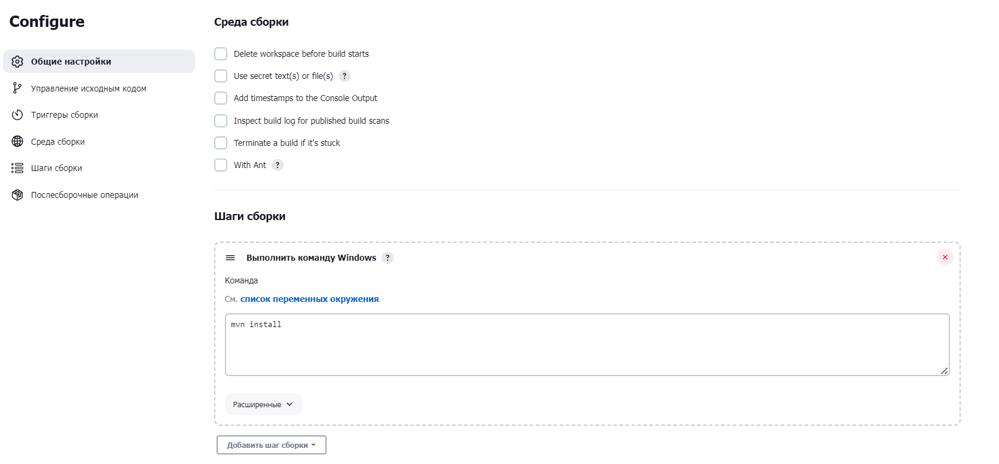
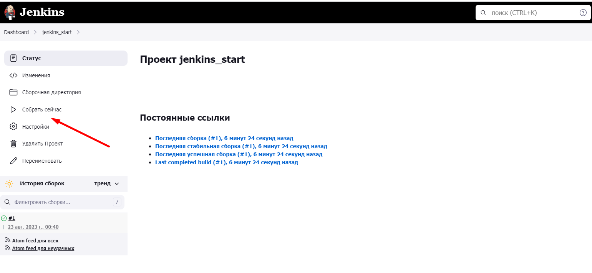
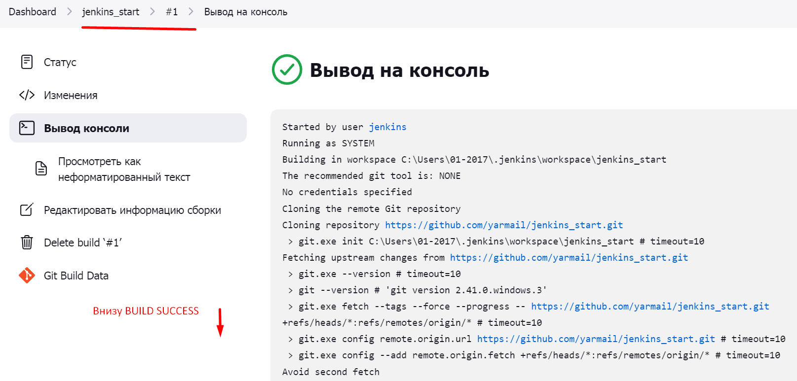

<a href="/README.md">вернуться к оглавлению</a>

<b>Выполняем работу в Jenkins</b>   

Выбираем пункт "Создать Item" и задаем иму имя (например jenkins_start)  
после чего выбираем - Создать задачу со свободной конфигурацией 

Скрин

  

Преходим к настройкам Configure 
Раздел Общие настройки. 
Чтобы не забивать сильно жесткий диск рекомендуется использовать настройку 
"Удалять устаревшие сборки" > "Сколько последних сборок хранить" > (например 3).  

Раздел Управление исходным кодом
Указываем расположение нашего проекта на Github

Скрин

 

Раздел Шаги сборки  
Далее нужно добавить выполнение Maven сборки (mvn install)
и Сохранить

Скрин

 

После сохрания наш созданный вариант сборки окажется на главной Панели  
Откуда его можно будет запустить зеленым треугольником, 
или, зайдя в проект выбрать меню "Собрать сейчас"

Скрин

 
Внизу появится история запусков, Если кликнуть один из пунктов,
то можно посмотреть лог выполнения

Скрин

